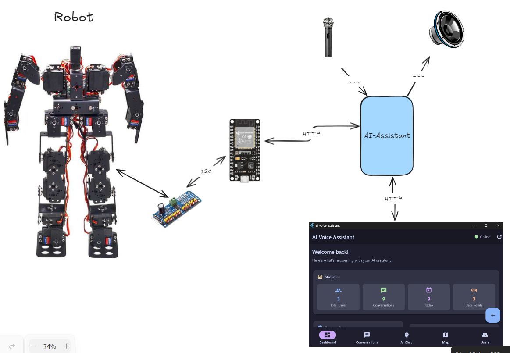

# AI-Robot-System
Ai robot system root dir.

## Structure
This is the root repocitory of AI Robot Project and , the project will make of different project directories , this will be the root 

```
AI-Robot-System
    |
    -- Microcontroller Code
    -- Schematics
    -- Website 
    -- Robot Shell 
```

## Intro

Mission: 
We have a robot, which has motors, we have to make it walk. 


Rough Sketch of the Project:


i will update this image ASAP , currently no time.

What we have : 
1. 17 Servo , Humanod Robot
2. Raspberry Pi 5
3. Pi Cam   
4. Lidar 
5. PCA9685
etc . etc
So we have the hardware to make it . Its only a matter of putting thing to gether. 

## Addons 
### AI-Assistant
An AI Assistant , which can interact with the user. 

AI? -> It thinks before answering.

### AI-Assistant-UI 
A web and GUI Interface for the AI Assistant.


## Teams
We have 
1. Hardware Team
2. Software Team
3. AI Team
4. Web Team


### [AI Assistant Team](https://github.com/orgs/Embedded-Systems-GCEK/teams/ai-assistant-team)

```sql
MEMBERS: 9
Designers: 2
Developers: 4
Testers: 2
Refactorers : 1 

```

[Whatsapp Group Link](https://chat.whatsapp.com/Ga3031FhGwwFcBlmVDQV36)

| Name                                                                                     | Role       | Status | Contributions |
| ---------------------------------------------------------------------------------------- | ---------- | ------ | ------------- |
| [Arun cs](https://github.com/orgs/Embedded-Systems-GCEK/people/aruncs31s)                | Designer   | ✅      |               |
| [vyshnav kp](https://github.com/orgs/Embedded-Systems-GCEK/people/vyshnav8486)           | Designer   | ✅      |               |
| [Abhaya Govind](https://github.com/orgs/Embedded-Systems-GCEK/people/AbhayaGovind)       | Developer  | ✅      |               |
| [Dhanashyam Babu](https://github.com/orgs/Embedded-Systems-GCEK/people/dhanashyam18)     | Developer  | ✅      |               |
| [Amaya Pramod. P. V](https://github.com/orgs/Embedded-Systems-GCEK/people/AmayaPramod)   | Developer  | ✅      |               |
| [Nivedh-r](https://github.com/orgs/Embedded-Systems-GCEK/people/Nivedh-r)                | Developer  | ✅      |               |
| [Meenakshi Poyyil](https://github.com/orgs/Embedded-Systems-GCEK/people/MeenakshiPoyyil) | Tester     | ✅      |               |
| [Sneha-SJ-05](https://github.com/orgs/Embedded-Systems-GCEK/people/Sneha-SJ-05)          | Tester     | ✅      |               |
| [Albertjoe007](https://github.com/orgs/Embedded-Systems-GCEK/people/Albertjoe010)        | Refactorer | ❌      |               |

^a51682

✅ -> Currently Done any Contribution 
❌ -> Currently Has not done any Contribution

### [AI Assistant UI Team](https://github.com/orgs/Embedded-Systems-GCEK/teams/user-interface-team)

```sql
MEMBERS: 4
Designers: 2
Developers: 2
Testers: 2
Refactorers : 0 

```
[Whatsapp Group Link](https://chat.whatsapp.com/Bw1oRD6TvlQ51wOG1oWVmi)


| Name                                                                                     | Role               | Status | Contributions |
| ---------------------------------------------------------------------------------------- | ------------------ | ------ | ------------- |
| [Arun cs](https://github.com/orgs/Embedded-Systems-GCEK/people/aruncs31s)                | Designer           | ✅      |               |
| [Abhaya Govind](https://github.com/orgs/Embedded-Systems-GCEK/people/AbhayaGovind)       | Designer,Developer | ❌      |               |
| [Meenakshi Poyyil](https://github.com/orgs/Embedded-Systems-GCEK/people/MeenakshiPoyyil) | Developer , Tester | ❌      |               |
| [Sneha-SJ-05](https://github.com/orgs/Embedded-Systems-GCEK/people/Sneha-SJ-05)          | Developer , Tester | ❌      |               |

✅ -> Currently Done any Contribution 
❌ -> Currently Has not done any Contribution

###  [Hardware Team](https://github.com/orgs/Embedded-Systems-GCEK/teams/hardware-team)

```sql
MEMBERS: 7
Designer: 3
Builder: 4

```

[Hardware Team Whatsapp Group Link](https://chat.whatsapp.com/LFyXfEnbvgYBliRHmHAzqu)

| Name                                                                                     | Role     | Status | Contributions |
| ---------------------------------------------------------------------------------------- | -------- | ------ | ------------- |
| [Arun cs](https://github.com/orgs/Embedded-Systems-GCEK/people/aruncs31s)                | Designer | ✅      |               |
| [Meenakshi Poyyil](https://github.com/orgs/Embedded-Systems-GCEK/people/MeenakshiPoyyil) | Designer | ✅      |               |
| [Sangeeth Binu](https://github.com/orgs/Embedded-Systems-GCEK/people/Sangeeth-binu)      | Designer | ✅      |               |
| [Abhaya Govind](https://github.com/orgs/Embedded-Systems-GCEK/people/AbhayaGovind)       | Builder  | ✅      |               |
| [Deepika Rajan](https://github.com/orgs/Embedded-Systems-GCEK/people/DEEPIKARAJAN-E)     | Builder  | ✅      |               |
| [Anu19692004](https://github.com/orgs/Embedded-Systems-GCEK/people/isro19692004geck)     | Builder  | ✅      |               |
| [Krishnasree-A-V](https://github.com/orgs/Embedded-Systems-GCEK/people/Krishnasree-A-V)  | Builder  | ✅      |               |
|                                                                                          |          |        |               |

✅ -> Currently Done any Contribution 
❌ -> Currently Has not done any Contribution

### [Software Team](https://github.com/orgs/Embedded-Systems-GCEK/teams/software)

[Whatsapp Group Link](https://chat.whatsapp.com/G9kQ1RHsp9i1kEQ5SZLHyl)


| Name                                                                                     | Role                 | Status |
| ---------------------------------------------------------------------------------------- | -------------------- | ------ |
| [Harikesh O P](https://github.com/orgs/Embedded-Systems-GCEK/people/HarikeshopGCEK)      | Designer , Developer | ✅      |
| [Meenakshi Poyyil](https://github.com/orgs/Embedded-Systems-GCEK/people/MeenakshiPoyyil) | Designer ,Developer  | ✅      |
| [Sangeeth Binu](https://github.com/orgs/Embedded-Systems-GCEK/people/Sangeeth-binu)      | Designer ,Developer  | ✅      |
| [AbhinavM2005](https://github.com/orgs/Embedded-Systems-GCEK/people/AbhinavM2005)        | Designer             | ✅      |
| [Saifali1256](https://github.com/orgs/Embedded-Systems-GCEK/people/Saifali1256)          |                      | ❌      |
| [Arun cs](https://github.com/orgs/Embedded-Systems-GCEK/people/aruncs31s)                | Developer            | ✅      |

### [Web Team](https://github.com/orgs/Embedded-Systems-GCEK/teams/web-team)

```sql
MEMBERS: 7
Designers: 3
Developers: 6
Refactorers : -
Nill : 1

```

[Web Team Whatsapp Group Link](https://chat.whatsapp.com/BUaxURbXiJX0Iy6bn8I9OL)

| Name                                                                                          | Role                 | Status | Contributions |
| --------------------------------------------------------------------------------------------- | -------------------- | ------ | ------------- |
| [Arun cs](https://github.com/orgs/Embedded-Systems-GCEK/people/aruncs31s)                     | Designer , Developer | ❌      |               |
| [sanjusathian](https://github.com/orgs/Embedded-Systems-GCEK/people/sanjusathian)             | Designer , Developer | ❌      |               |
| [the-unknown-monkey](https://github.com/orgs/Embedded-Systems-GCEK/people/the-unknown-monkey) | Designer , Developer | ❌      |               |
| [Abhaya Govind](https://github.com/orgs/Embedded-Systems-GCEK/people/AbhayaGovind)            | Developer            | ❌      |               |
| [Sangeeth Binu](https://github.com/orgs/Embedded-Systems-GCEK/people/Sangeeth-binu)           |                      | ❌      |               |
| [Sneha-SJ-05](https://github.com/orgs/Embedded-Systems-GCEK/people/Sneha-SJ-05)               | Developer            | ❌      |               |
| [Dhanashyam Babu](https://github.com/orgs/Embedded-Systems-GCEK/people/dhanashyam18)          | Developer            | ❌      |               |

✅ -> Currently Done any Contribution 
❌ -> Currently Has not done any Contribution

### How o join a team?
1. Go to the open the whatsapp link and join the group.
2. Done